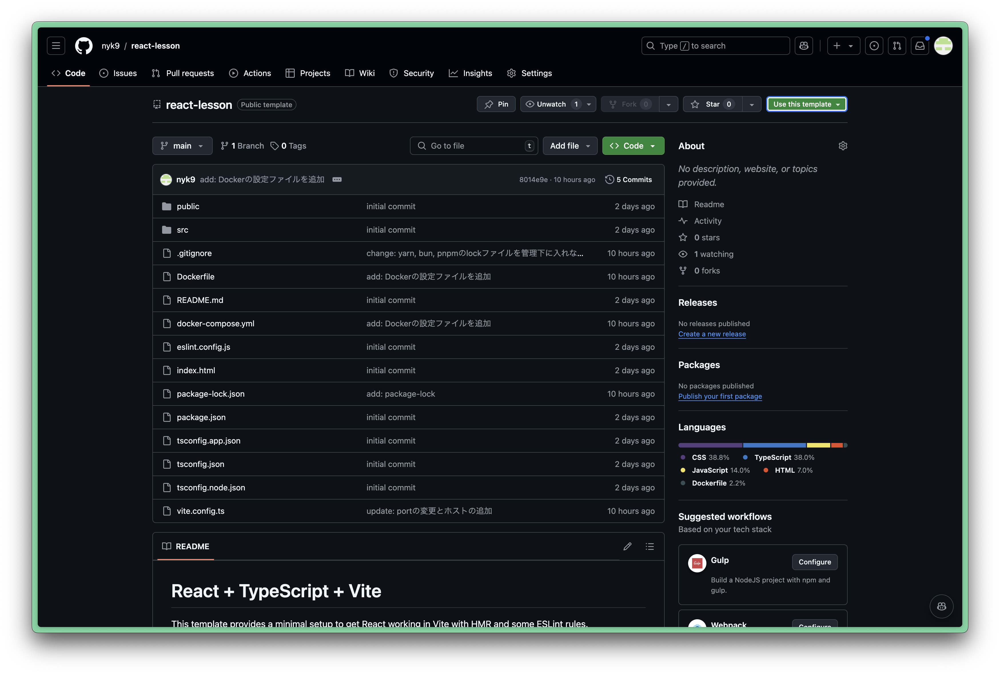

# React + TypeScript + Vite

## 開発環境の構築手順

### 目次
- [共通編](#github)
- [手元環境編](#npm)
- [docker編](#docker) (必須ではない)

### github

1. このテンプレートリポジトリを元に自分の作業用リポジトリを新しく作成する
   - リポジトリ画面の右上にある「Use this template」をクリックし、その後「Create a new repository」を選択する
   

2. リポジトリ作成画面に移るので、Repositoryの名前を自分で入力し、Create repositoryをクリックする。
    - ここではリポジトリの名前はreact-lessonとする。

3. 自分のアカウントでリポジトリが作成されるので、「<> Code」と書かれた緑のボタンをクリックし、HTTPSのURLをコピーする。
   - その後、自分のPC上でターミナルを開き、任意の場所に移動（ドキュメントなど作業用のファイル・フォルダーがあるところが望ましい）し、以下のコマンドをターミナルに入力する
   ```bash
   git clone [コピーしたURL]
   ```

   - もしエラーなどがでる場合はURLが正しいか、git が入っているか(git -v でバージョン確認できる)などを確認する。

   - どうしても無理なら、<> CodeのDownload ZIPで手動でファイルをインポートする。

### npm
#### 開発環境の構築
1. ターミナルで先ほど作ったリポジトリに移動する。
    ``` bash
    cd ./react-lesson
    ```

2. 必要なライブラリーをインポートする。
    ``` bash
    npm i 
    ```

    - node_modulesファイルなどが作られない場合は、以下のコマンドを入力し、npmが使えるかどうか調べる
    ``` bash 
    npm -v
    ```

3. エディタでリポジトリを開く
    VS Code : code, Cursor : cursor, Zed : zed など
    ``` bash
    code .
    ```

#### 開発中に便利なもの
1. 開発者サーバーを立ち上げる
    - npm run devで開発者サーバーを立ち上げることができる。
    - [開発者サーバーへのリンク](http://localhost:3000)
    ``` bash
    npm run dev
    ```
    - 開発者サーバーでは自分が変更したファイルの情報がすぐに反映さるので、開発中はエディタと画面を分割して作業するのがオススメ
    
2. 本番環境想定
    - 本番環境ではサーバーはビルドコマンドを実行して、HTML, CSS, JSファイルを生成してそれをwebサイトとして公開している。
    ``` bash
    npm run build
    ```
    - 実際に確認する方法(最後にビルドしたときの内容が表示されることに注意)
    ``` bash
    npm run preview
    ```

3. その他
    - [package.json](./package.json)の中のscriptsの中のコマンドは全て使える。


### docker

<!-- ここにdocker編の内容を追加 -->